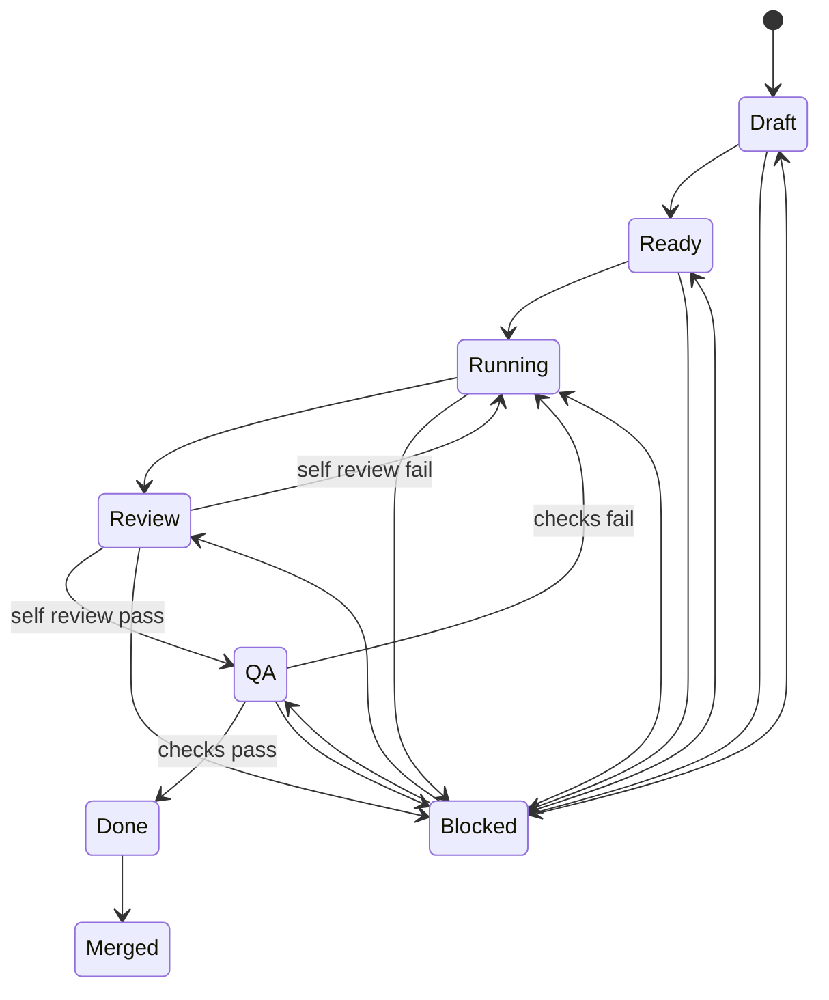

# Lane States

## Primary state machine

| State | Meaning | Entry condition | Exit condition |
|---|---|---|---|
| Draft | Lane created but not committed for execution | Task is defined, owner not confirmed | Move to `Ready` when dependencies and acceptance are clear |
| Ready | Ready to start | Owner, deps, target paths, and confidence target are complete | Move to `Running` when the agent begins work |
| Running | Producing output | Work has started and visible progress exists | Output can be reviewed Result `Review` |
| Review | Self-review and discrepancy correction | lane Output complete, Enter the review workflow | Move to `QA` on self-review pass; return to `Running` on failure |
| QA | Existing checks and acceptance confirmation | Harness or minimum validation has run | Move to `Done` on pass; return to `Running` on failure |
| Done | Lane delivery complete, awaiting integration | Review, QA, and memory update complete | Move to `Merged` after integrating into the mainline or parent task |
| Merged | Merged into baseline | Changes or documentation landed on the mainline | Terminal state |

## Blocked determination

| Rule | Threshold | Action |
|---|---|---|
| No State changes and no new Output | 3 consecutive rounds | Mark `blocked=true`, Queues to `Blocked` |
| Dependency unmet | Any prerequisite lane is not `Done/Merged` | Keep the original owner State and show the reason for waiting |
| Owner or contract conflict | Trigger immediately on discovery | Return to PM arbitration; Architect converges when needed |

##Restore Rule

1. `Blocked` is an overwrite mark, not a replacement for the main State; after recovery, it returns to the main State before being blocked.
2. Unblocking must record `unblock_reason` and the plan for the new round.
3. If `Review` or `QA` returns a lane twice in a row, check whether the Planner decomposed it too coarsely.

## Transition diagram

## Dashboard hooks

- Count keys: `lane_state_counts`, `blocked_lane_count`
- Duration keys: `state_entered_at`, `blocked_since`, `last_progress_at`
