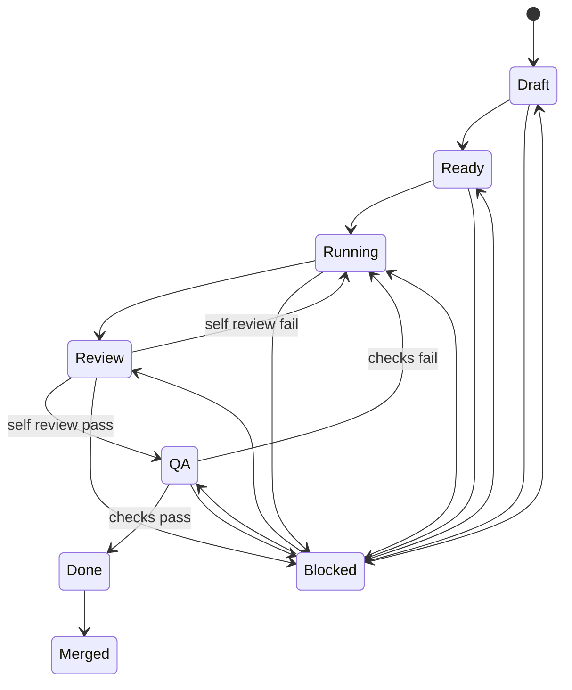

# Lane States

## 主状态机

| 状态 | 含义 | 进入条件 | 退出条件 |
|---|---|---|---|
| Draft | Lane 已创建但未承诺执行 | Task 已定义,owner 未确认 | 依赖清晰且验收明确后进 `Ready` |
| Ready | 可启动 | owner、deps、目标路径、confidence target 齐全 | agent 开始工作后进 `Running` |
| Running | 正在产出 | 已开工且有可见进展 | 产出可审查结果后进 `Review` |
| Review | 自检与差异修正 | lane 产出齐全,进入 review workflow | 自检通过进 `QA`,失败回 `Running` |
| QA | 现有检查与验收确认 | harness 或最小验证已运行 | 通过进 `Done`,失败回 `Running` |
| Done | Lane 交付完成待集成 | review、QA、memory update 完成 | 合入主线或父任务后进 `Merged` |
| Merged | 已并入基线 | 变更或文档已落主线 | 终态 |

## Blocked 判定

| 规则 | 阈值 | 动作 |
|---|---|---|
| 无状态变化且无新产出 | 连续 3 轮 | 标记 `blocked=true`,队列转 `Blocked` |
| 依赖未满足 | 任一前置 lane 非 `Done/Merged` | 保持原主状态,展示等待原因 |
| owner 冲突或契约冲突 | 发现即触发 | 回 PM 仲裁,必要时 Architect 收敛 |

## 恢复规则

1. `Blocked` 是覆盖标记,不是替代主状态; 恢复后回到被阻塞前的主状态。
2. 解除阻塞必须写明 `unblock_reason` 与新一轮计划。
3. `Review` 或 `QA` 连续两次打回,应回看 Planner 是否拆分过粗。

## 流转图

## Dashboard hooks

- 计数键: `lane_state_counts`, `blocked_lane_count`
- 时长键: `state_entered_at`, `blocked_since`, `last_progress_at`
